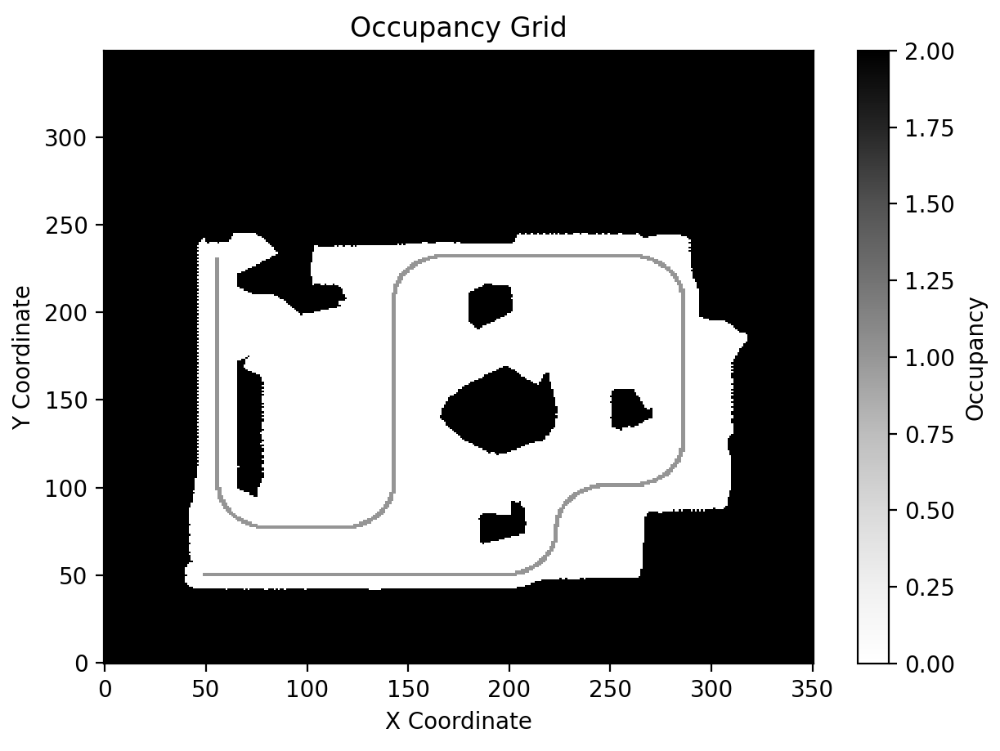

# Occupancy Grid Mapping Project

## Overview
This project implements an **Occupancy Grid Mapping** system using C++. The software reads data from ultrasonic sensors and odometry to generate an obstacle map for a small homemade robot.

## Features
- **CSV data processing** to read sensor measurements.
- **Occupancy grid representation** to visualize obstacles.
- **Python visualization script** to display the resulting occupancy grid.

## Project Structure
```
├── grid.cpp          # Implements occupancy grid logic
├── grid.hpp          # Header file for grid operations
├── main.cpp          # Main program entry point
├── processCSV.cpp    # Reads and processes CSV sensor data
├── processCSV.hpp    # Header file for CSV processing
├── robot.csv         # Sample sensor data file
├── robot.h           # Defines robot characteristics
├── robotpos.h        # Defines robot position structure
├── sensor.h          # Defines sensor-related structures
├── visualize.py      # Python script for visualization
```

## Data Format
The `robot.csv` file contains sensor measurements with the following columns:
1. **Timestamp (ms)**: Time from the start of data collection.
2. **X Position**: Robot's x-coordinate.
3. **Y Position**: Robot's y-coordinate.
4. **Orientation (radians)**: Heading angle.
5. **Ultrasonic Sensor 1 (s)**: Time of flight.
6. **Ultrasonic Sensor 2 (s)**: Time of flight.
7. **Ultrasonic Sensor 3 (s)**: Time of flight.
8. **Ultrasonic Sensor 4 (s)**: Time of flight.

## Methodology
1. **Read CSV Sensor Data**: The program reads `robot.csv` to extract position and sensor readings.
2. **Convert Time of Flight to Distance**:
   - Distance = (Time of Flight × Speed of Sound) / 2
3. **Map Sensor Data to Grid**:
   - The grid represents the environment in a 2D array.
   - Cells are marked as **occupied (2)** or **free (0)**.
   - All unknown cells are initially considered as walls to enhance safety.
   - The system assigns a probability to each cell which is on the robot's path to allow easy visualization.
   - A **probability distribution** is applied based on the cell's angle relative to the centerline of the sensor.
   - Cells near the sensor centerline are more likely to be walls, while cells at the edges of the sensor cone have a lower probability of being considered a wall.
   - The probability distribution follows a **linear model**, where the likelihood is **1 at the centerline** and **0 at the edge** of the sensor cone.
4. **Occupancy Grid Update Process**:
   - Sensor time values are converted into distances using the speed of sound.
   - The grid is divided into rows and columns, and each cell is evaluated based on its center position.
   - Considering the sensor locations and orientations, each sensor's position and angle are computed using a 2D coordinate transformation.
   - Each sensor individually evaluates the occupancy of the grid, determining whether a given point falls within the sensor’s field of view.
   - If the point is inside the field of view, a probability value is substracted to the corresponding grid cell based on how centrally it is located within the sensor’s FOV.
   - The assumption made is that the probability of an obstacle at the centerline of the sensor's field of view is 1.0, while at the edges of the 30-degree FOV, it is 0.0. A linear transition is applied between these two extremes.
   - Once all cells are evaluated, those that exceed a threshold value are set to **2 (occupied)**, while those below the threshold are set to **0 (free space)**.
5. **Visualize the Map**:
   - The `visualize.py` script loads the `output.csv` file and generates a grayscale occupancy map using Matplotlib.
   - In addition to the grid, the robot’s x and y coordinates are also displayed to illustrate its movement.
   
<p align="center">
  
</p>
<p align="center"><b></b> Final occupancy grid visualization.</p>


## How to Run the Program
### C++ Implementation
1. **Compile the project**:
   ```sh
   g++ src/main.cpp src/grid.cpp src/processCSV.cpp -o main
   ```
2. **Run the executable**:
   ```sh
   ./main
   ```
   This generates `output.csv` containing the occupancy grid.

### Visualization (Python)
1. **Install dependencies**:
   ```sh
   pip3.13 install numpy matplotlib pandas
   ```
2. **Run the script**:
   ```sh
   python3 src/visualize.py
   ```


## Future Improvements
- Implement **Bayesian Filtering** for better occupancy estimation.
- Integrate **Kalman Filtering** for improved odometry accuracy.
- Support for **real-time sensor fusion** with additional sensors.

---
This project provides a foundation for autonomous robot navigation using ultrasonic sensors and occupancy grids.

